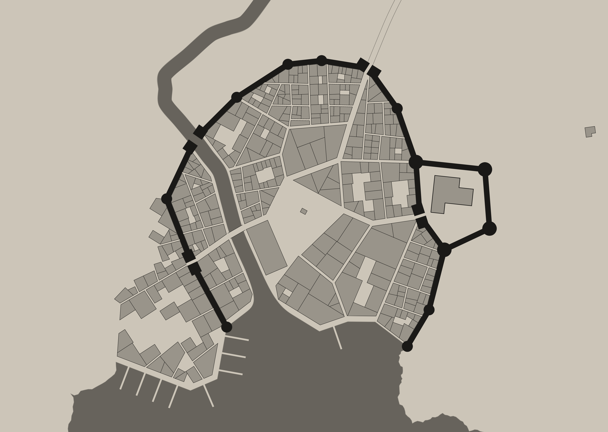
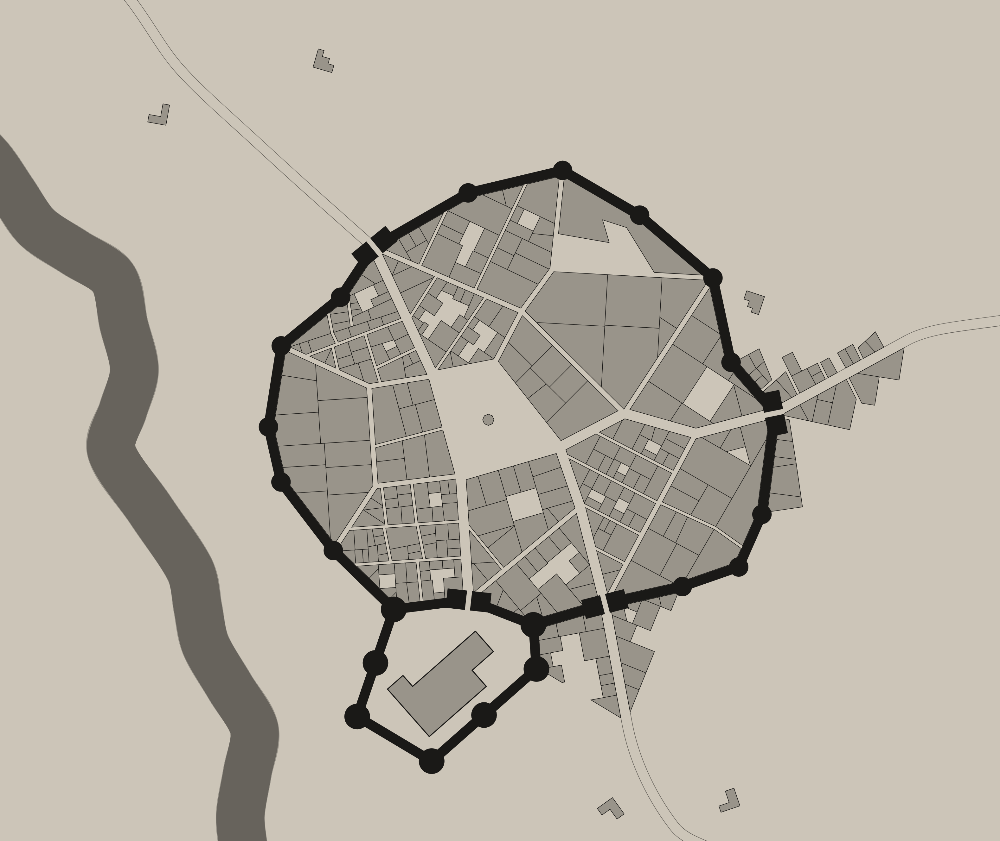

Sede del Consejo Élfico y hogar de la mayor población feérica de Dexudal. En sus costas se llevan a cabo la mayoría de los intercambios comerciales de la zona Este de Dexudal.

* Tabla de Contenidos
{:toc}

## Historia

Hace miles de años, la isla estaba habitada exclusivamente por elfos y eladrines. Las distintas ciudades eran gobernadas por un único rey eladrin de la [Casa Zeinnar](../_houses/casa-zeinnar.md).

Unos cincuenta años antes de la [Guerra de las Mil Antorchas](../_eras/guerra-mil-antorchas.md), siendo [Connak Zeinnar](../_chars/connak-zeinnar.md) regente, las islas humanas cercanas comenzaron una sangrienta guerra religiosa que acabó con dos tercios de su población. La mayor parte de los supervivientes se refugiaron en Limedenn, acogidos por Connak. Los elfos no apoyaban esta decisión y se revelaron contra su rey, expulsando a la familia real e [instaurando un consejo de sabios](../eras.md) que dirigiría la isla.

Con la ayuda de [Tharum](../_chars/tharum-aerian.md), el mago de la corte, Connak huyó junto a sus tres hijos hacia el sur de la isla, a una fortaleza oculta en el bosque. Se cree que sólo quedan vivos el rey y su hija menor, [Veralian](../_chars/veralian-zeinnar.md).

Pese a las constantes disputas entre elfos y humanos, estos últimos han logrado construir ciudades y asentarse en la parte oeste de la isla, donde disponen de fácil acceso al mar y a los puertos, mediante los cuales comercian con otras islas.

Atraídos por el comercio y la abundancia de recursos naturales, varias expediciones de enanos se asentaron en las zonas montañosas de la isla, donde erigieron sus fortalezas. Un pequeño grupo de enanos se instaló en el Paso de Vargalir, obligando a las caravanas comerciales a pagar peaje. El Consejo Élfico, dado su inexistente interés en el comercio con los humanos, permitió que los enanos tomasen control absoluto de la zona montañosa.

## Accidentes Geográficos

### Bahía de Oranar

### Cicatriz Oeste

Concentración de cuevas entre las calas de la costa al oeste de la isla. Se trata de una zona de difícil acceso. La única forma de moverse entre las cuevas es mediante túneles bajo la costa, aunque los piratas son también capaces de navegar por la zona para desplazarse.

### Paso de Vargalir

Se trata de una caverna natural que conecta las dos mitades de la isla por debajo de la inmensa cordillera que las separa. En su interior se encuentra una fortaleza enana conocida como Morn Boldor.

Las paredes rocosas desprenden un tono azulado de forma natural debido a la alta concentración de poder arcano bajo el suelo de la isla.

## Ciudades

### Erithas

Ciudad élfica en el extremo oeste de la Bahía de Oranar. El administrador de la ciudad, [Vamis Nerifiel](../_chars/vamis-nerifiel.md), es un vampiro en secreto.

En esta ciudad se encuentra el mayor templo de la isla, dedicado a Ioun y Corellon.

### Phezi

Al Noroeste de Limedenn se encuentra la mayor ciudad humana de la isla: Phezi. Poblada mayoritariamente por humanos. La ciudad está rodeada por una alta muralla, custodiada por la milicia voluntaria de la ciudad.

Su población adora a Bahamut, y se pueden contemplar varios templos erigidos a este dios repartidos por la ciudad.

### Schmitford

Al sur de la isla y a una jornada de Hybris, es la primera ciudad humana que se construyó.

### Ulelin

Ciudad élfica en el extremo este de la Bahía de Oranar. En su fortaleza se asienta el [Consejo Élfico](../_institutions/consejo-elfico.md).

## Pueblos y Aldeas

### Hybris

Al oeste de la isla, y a una jornada de Phezi, encontramos un pequeño pueblo pesquero. Habitado por una gran variedad de razas, entre las que destacan elfos y eladrines. De tamaño reducido, cuenta con varias tabernas a disposición de los viajeros recién llegados de otras islas.

El pueblo se encuentra sobre un laberíntico alcantarillado de piedra, habitado por distintos tipos de goblin y estirges. Desde este laberinto es posible acceder a cualquier edificio del poblado, e incluso abandonarlo por el bosque sin ser visto por la guardia.

## Fortalezas

### Girkihm

Fortaleza enana, situada al noroeste de Morn Boldor, en un claro en el interior del Bosque de Druindar, se trata de la base de operaciones de los [Seguidores de Zholar](../_factions/seguidores-de-zholar.md).

### Morn Boldor

Fortaleza enana bajo la cordillera central de la isla. La única forma de acceso es mediante el Paso de Vargalir, que cruza la cordillera de lado a lado, uniendo las dos mitades de la isla.

La fortaleza es gobernada por [Thabreck Corazón de Bronce](../_chars/thabreck.md), y su población adora a Moradín pero respeta el culto a Bahamut.

Los enanos de Morn Boldor son mineros por naturaleza, y unos grandes combatientes. Viven en su fortaleza bajo la montaña, pero realizan expediciones regulares al exterior para proteger la entrada al Paso de Vargalir.

Algunos enanos de Morn Boldor forman parte de los [Seguidores de Zholar](../_factions/seguidores-zholar.md).

## Posadas y Tabernas

### Caseta de Sagh

Una pequeña posada a un cuarto de jornada al este de Hybris. El edificio, de dos plantas, cuenta con cuatro habitaciones y un extenso salón con mesas largas y bancos, ideal para que los grupos de guerreros puedan parar a beber y hablar de sus últimas aventuras.

El propietario, [Sagh](../_chars/sagh.md), es líder del grupo conocido como [Los 21 Amigos de Sagh](../_factions/amigos-de-sagh.md)
